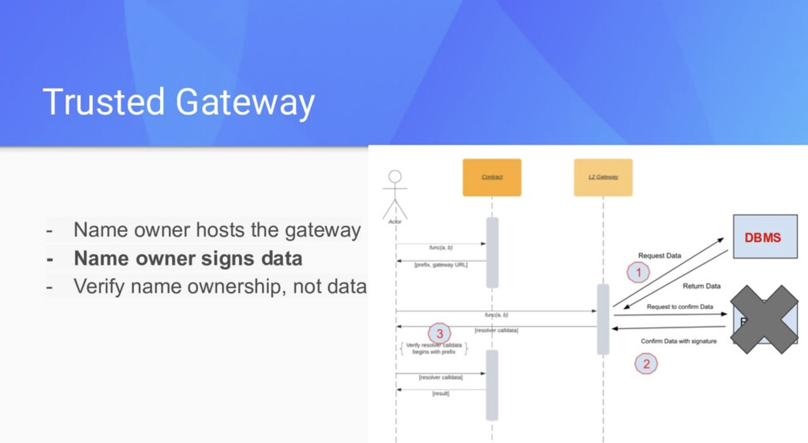

# Trusted gateway ERC20 token example

## Summary

This example showcase a simple token airdrop usecase using a [trusted gateway](https://speakerdeck.com/makoto_inoue/ens-on-layer2-at-ethcc-2021?slide=29) model where a gateway signs responses with a private key and the contract verifies the data using the signing account's address.



## The flow

### Showing the token balance

- An ERC20 token on L1 has `signer` field and the token owner can set an Ethereum address. 
- The gateway server has a flat file containg the list of ethereum address and how many tokens to airdrop.
- When a client calls `token.balanceOf(address)` on L1, it throws `OffchainLookup` error with the gateway server url.
- When the client calls the token gateway server, it checks the file to see if the `address` qualifies for the airdrop and how many, signs the message of `balance` and `address` with the private key of the `signer`, and returns balance and signature.
- The client then calls `token.balanceOfWithSig()` with the proof.
- The L1 token verifies that the message was signed by `token.signer` and returns the balance.

### Claiming and transferring tokens

Becuase `Token.balanceOf` shows the balance of the both L1 and off chain information, users don't need to explicitly claim tokens. When a user transfers tokens from an account for the first time, the airdrop balance is automatically claimed for them.

- When the client calls `token.transfer(recipient, amount)` on L1, it throws `OffchainLookup` error with the gateway server url.
- When the client calls the token gateway server, it checks the file to see if the `from` address qualifies for the airdrop and how much, signs the message of `balance` and `address` with the private key of the `signer`, and returns balance and signature.
- The client then calls `token.transferWithSig()` with the proof.
- The L1 token verifies that the message was signed by `token.signer`, `mints` new token for the `balance` , then transfers the `amount` to the `recipient`.

## Running the example

### 1. Clone the repo and copy the .env file

```
git clone https://github.com/smartcontractkit/ccip-read
cd ccip-read
yarn install
cd packages/examples/trusted-gateway-token
cp .env.local .env
```

### 2. Start local Ethereum node

```
cd contracts
npx hardhat node
```

### 5. Deploy the contract

```
$ yarn deploy
yarn run v1.22.10
$ npx hardhat run --network localhost scripts/deploy.js
Token deployed to: 0x5FbDB2315678afecb367f032d93F642f64180aa3
The signer is set to: 0xf39Fd6e51aad88F6F4ce6aB8827279cffFb92266
Saving as TOKEN_ADDRESS to: ../.env
✨  Done in 1.90s.
```

This will add `TOKEN_ADDRESS` to the .env file

### 6. Run the server

```
cd ../server
yarn start
```

### 7. Run the client

```
cd ../client
yarn start
```

If successful, the client will output the following messages demonstrating that SENDER had tokens to claim and transferred 1 of the tokens to RECIPIENT.

```
SENDER 0x70997970C51812dc3A010C7d01b50e0d17dc79C8 balance 1000000000000000000000
RECIPIENT 0x8626f6940e2eb28930efb4cef49b2d1f2c9c1199 balance 1000000000000000000000
TRANSFER 1 from 0x70997970C51812dc3A010C7d01b50e0d17dc79C8 to 0x8626f6940e2eb28930efb4cef49b2d1f2c9c1199
SENDER 0x70997970C51812dc3A010C7d01b50e0d17dc79C8 balance 999999999999999999999
RECIPIENT 0x8626f6940e2eb28930efb4cef49b2d1f2c9c1199 balance 1000000000000000000001
```
